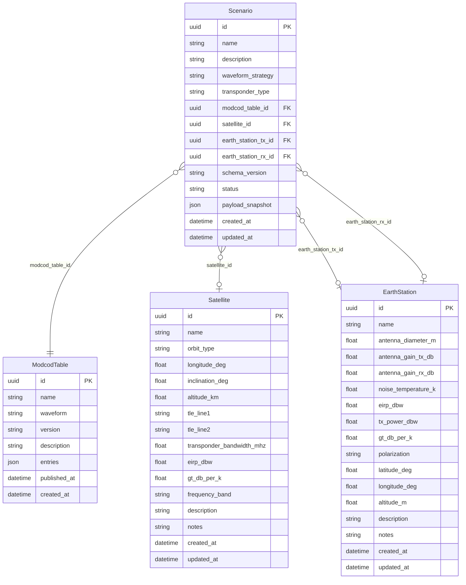

# System Architecture

This document describes the architecture of the NTN Link Budget Tools system.

## High-Level Overview

## Component Details

### Frontend (React)

### Backend Layers

## Data Flow

### Link Budget Calculation

### Agentic Workflow

## Database Schema

## Agent Architecture (LangGraph)

### State Structure

## Propagation Models

## Deployment Architecture

## Security Model

> **Note**: This system is designed for development use only. Production deployment requires additional security measures including authentication, HTTPS, and proper secret management.
